<div align="center">


# Rau

**Build real-time rendering techniques on the desktop and in the browser**

[](https://github.com/chicoferreira/rau/actions/workflows/build.yml)
[](LICENSE.md)

[**Try it in the browser →**](https://rau.chicoferreira.dev)

</div>

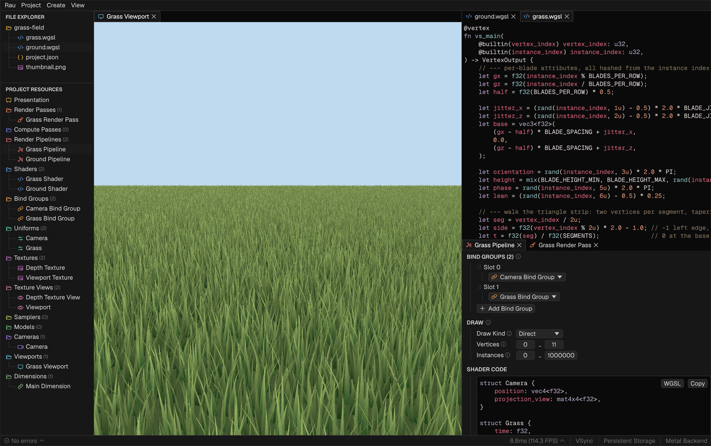

## What is Rau

Rau is a tool for building and experimenting with rendering techniques. You create the GPU objects a technique needs, such as shaders, textures, uniforms, bind groups, pipelines and passes, and connect them together.

Everything happens in an appealing interface. Resources are configured through inspectors, shaders can be created and edited in the built-in code editor, with the result updating in real time across tiled viewports that can show any intermediary texture. Errors, such as a shader that fails to compile, are caught and shown in the interface.

Rau is built in Rust with [wgpu](https://wgpu.rs), and its interface with [egui](https://github.com/emilk/egui).

## Examples

Each project below opens directly in the web version. They also appear under **Featured Projects** in the app's main menu.

<table>
  <tr>
    <td width="33%" valign="top">
      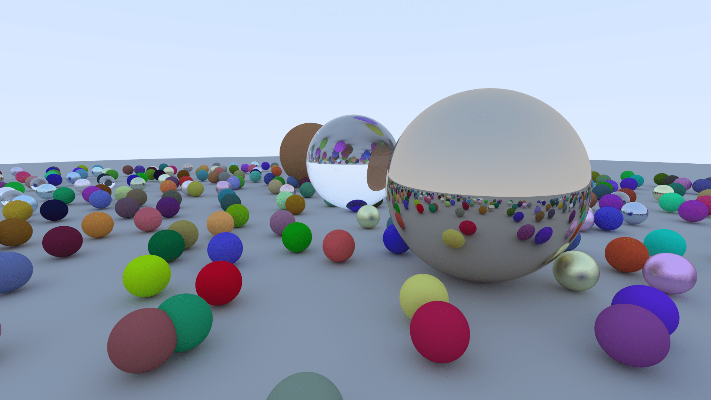
      <br /><b>Ray Tracing</b><br />
      Ported from <a href="https://raytracing.github.io/books/RayTracingInOneWeekend.html"><i>Ray Tracing in One Weekend</i></a>. Progressive rendering using compute shaders.
      <br /><a href="https://rau.chicoferreira.dev/?action=new&amp;owner=chicoferreira&amp;repo=rau&amp;ref=main&amp;path=projects/ray-tracing&amp;name=Ray%20Tracing">Open in browser</a> · <a href="projects/ray-tracing">Source</a>
    </td>
    <td width="33%" valign="top">
      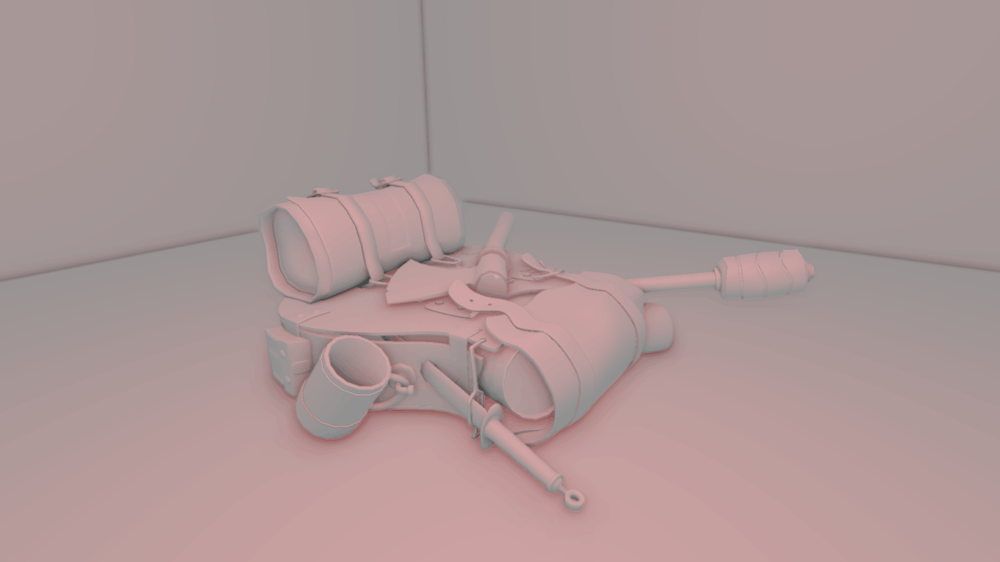
      <br /><b>SSAO</b><br />
      Ported from the <a href="https://learnopengl.com/Advanced-Lighting/SSAO">SSAO</a> chapter of LearnOpenGL.
      <br /><a href="https://rau.chicoferreira.dev/?action=new&amp;owner=chicoferreira&amp;repo=rau&amp;ref=main&amp;path=projects/ssao&amp;name=SSAO">Open in browser</a> · <a href="projects/ssao">Source</a>
    </td>
    <td width="33%" valign="top">
      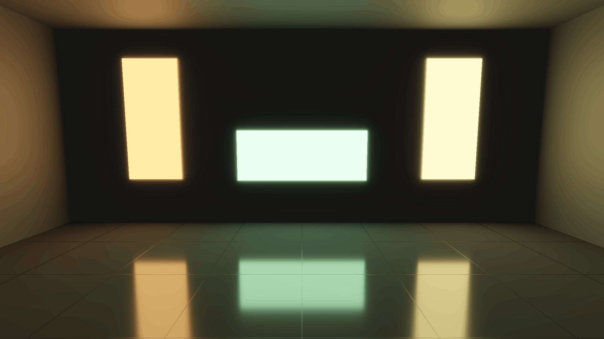
      <br /><b>Area Lights</b><br />
      Ported from the <a href="https://learnopengl.com/Guest-Articles/2022/Area-Lights">Area Lights</a> guest article of LearnOpenGL.
      <br /><a href="https://rau.chicoferreira.dev/?action=new&amp;owner=chicoferreira&amp;repo=rau&amp;ref=main&amp;path=projects/area-lights&amp;name=Area%20Lights">Open in browser</a> · <a href="projects/area-lights">Source</a>
    </td>
  </tr>
  <tr>
    <td width="33%" valign="top">
      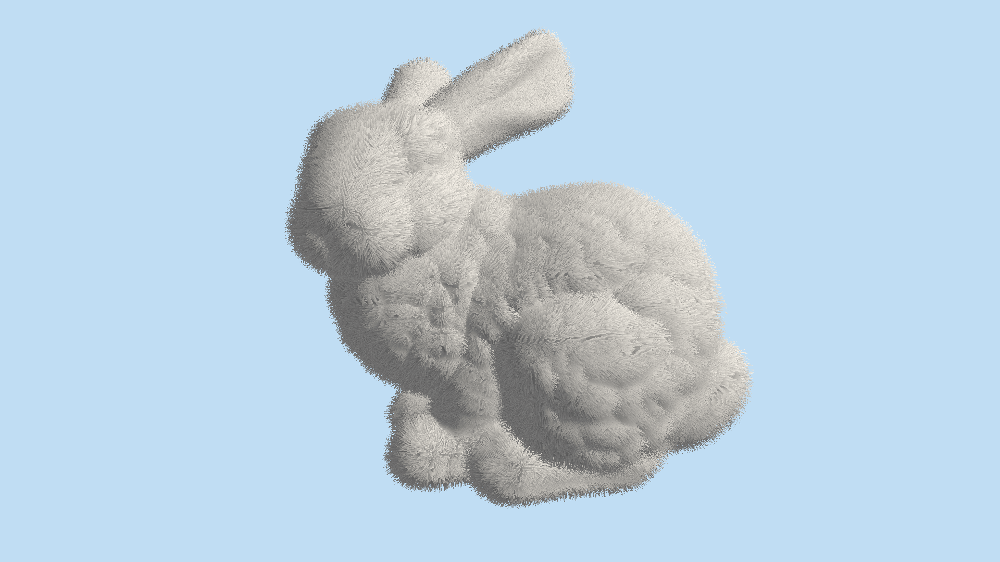
      <br /><b>Fur Shell</b><br />
      Based on <a href="https://hhoppe.com/fur.pdf"><i>Real-Time Fur over Arbitrary Surfaces</i></a>, applied to the Stanford Bunny.
      <br /><a href="https://rau.chicoferreira.dev/?action=new&amp;owner=chicoferreira&amp;repo=rau&amp;ref=main&amp;path=projects/fur-shell&amp;name=Fur%20Shell">Open in browser</a> · <a href="projects/fur-shell">Source</a>
    </td>
    <td width="33%" valign="top">
      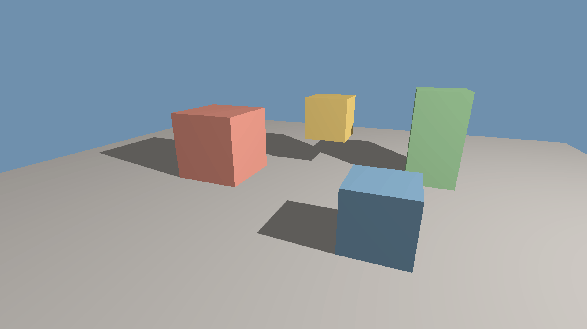
      <br /><b>Shadow Mapping</b><br />
      The classic two-pass shadow mapping.
      <br /><a href="https://rau.chicoferreira.dev/?action=new&amp;owner=chicoferreira&amp;repo=rau&amp;ref=main&amp;path=projects/shadow-mapping&amp;name=Shadow%20Mapping">Open in browser</a> · <a href="projects/shadow-mapping">Source</a>
    </td>
    <td width="33%" valign="top">
      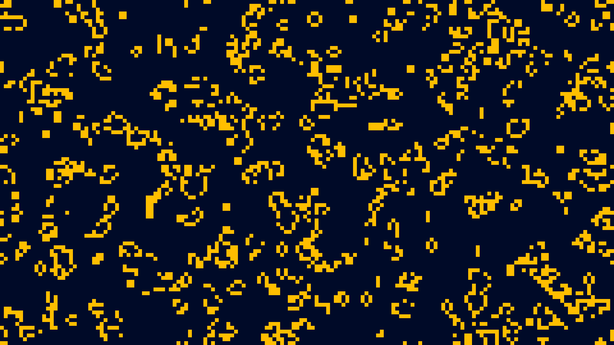
      <br /><b>Game of Life</b><br />
      Conway's Game of Life implemented with compute shaders.
      <br /><a href="https://rau.chicoferreira.dev/?action=new&amp;owner=chicoferreira&amp;repo=rau&amp;ref=main&amp;path=projects/game-of-life&amp;name=Game%20of%20Life">Open in browser</a> · <a href="projects/game-of-life">Source</a>
    </td>
  </tr>
  <tr>
    <td width="33%" valign="top">
      
      <br /><b>Parallax Mapping</b><br />
      Ported from the <a href="https://learnopengl.com/Advanced-Lighting/Parallax-Mapping">Parallax Mapping</a> chapter of LearnOpenGL.
      <br /><a href="https://rau.chicoferreira.dev/?action=new&amp;owner=chicoferreira&amp;repo=rau&amp;ref=main&amp;path=projects/parallax-mapping&amp;name=Parallax%20Mapping">Open in browser</a> · <a href="projects/parallax-mapping">Source</a>
    </td>
    <td width="33%" valign="top">
      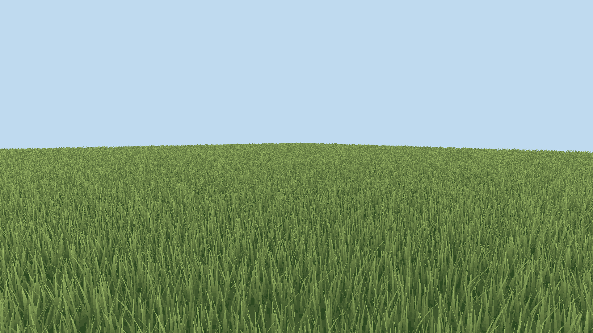
      <br /><b>Grass Field</b><br />
      A million blades, drawn in a single instanced draw call.
      <br /><a href="https://rau.chicoferreira.dev/?action=new&amp;owner=chicoferreira&amp;repo=rau&amp;ref=main&amp;path=projects/grass-field&amp;name=Grass%20Field">Open in browser</a> · <a href="projects/grass-field">Source</a>
    </td>
    <td width="33%" valign="top">
      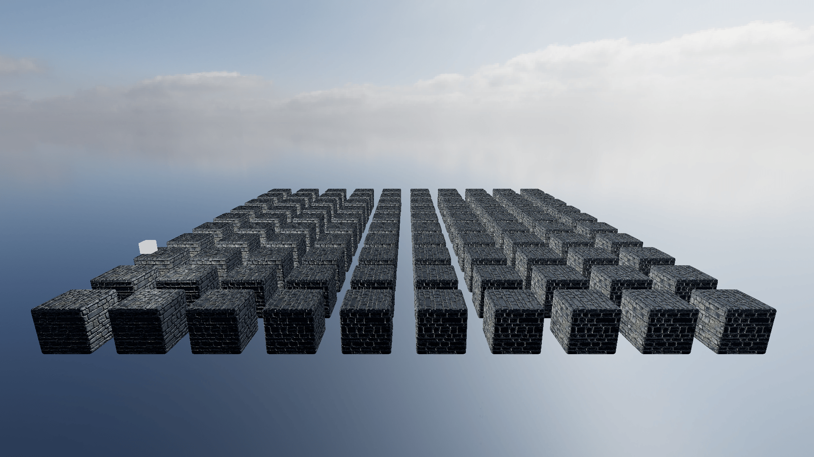
      <br /><b>HDR Skybox</b><br />
      Ported from <a href="https://sotrh.github.io/learn-wgpu/intermediate/tutorial13-hdr/">Learn WGPU</a>.
      <br /><a href="https://rau.chicoferreira.dev/?action=new&amp;owner=chicoferreira&amp;repo=rau&amp;ref=main&amp;path=projects/hdr-skybox&amp;name=HDR%20Skybox">Open in browser</a> · <a href="projects/hdr-skybox">Source</a>
    </td>
  </tr>
</table>

More examples can be found in [`projects/`](projects).

## Getting started

### In the browser

Open [rau.chicoferreira.dev](https://rau.chicoferreira.dev).

Some projects require WebGPU. Check the [WebGPU implementation status](https://github.com/gpuweb/gpuweb/wiki/Implementation-Status) for your browser and platform.

Projects are stored in the browser through IndexedDB.

### Download

Download the latest build for your platform from the [releases page](https://github.com/chicoferreira/rau/releases/latest). The builds are not signed, so each platform needs an extra step on first launch:

- **Windows:** unzip and run `rau.exe`. If SmartScreen warns about it, click **More info** → **Run anyway**.
- **macOS:** unzip and move `Rau.app` to Applications. On first launch, macOS blocks the app. Go to **System Settings** → **Privacy & Security** and click **Open Anyway**, or run `xattr -dr com.apple.quarantine /Applications/Rau.app` once.
- **Linux:** make the AppImage executable with `chmod +x rau-*.AppImage`, then run it.

### From source

With a [Rust toolchain](https://rustup.rs) installed, you can build and install the application with:

```bash
cargo install --git https://github.com/chicoferreira/rau --locked

# Run the application
rau

# Show all available commands
rau --help

# Open an existing project folder
rau open projects/ssao

# Create a new project on disk from a folder in a GitHub repository
rau new persistent ./my-ssao github --owner chicoferreira --repo rau --ref main --path projects/ssao
```

To work on Rau itself:

```bash
git clone https://github.com/chicoferreira/rau
cd rau
cargo run --release
```

### Building the web version

```bash
./web/build-web.sh --serve
```

This compiles the `wasm32-unknown-unknown` target and serves `web/` locally.

## Background

Rau is a redesign of [Nau3D](https://github.com/Nau3D/nau), a shader teaching tool from the University of Minho.

Rau was built as part of the MSc dissertation *Nau to WGPU* (Master's in Informatics Engineering, University of Minho, 2025/26). <!-- TODO: ADD LINK WHEN PUBLISHED -->

The dissertation covers the design in depth: the resource model, how changes propagate through resources, the storage backends shared by the native and web builds, and the example projects.

### Benchmarks

The dissertation also includes a performance analysis that compares Rau's CPU time, GPU time and memory usage against similar tools like [Nau3D](https://github.com/Nau3D/nau) and [SHADERed](https://github.com/dfranx/SHADERed). The benchmarks and their results can be found in the [rau-benchmarks](https://github.com/chicoferreira/rau-benchmarks) repository.

## Screenshots

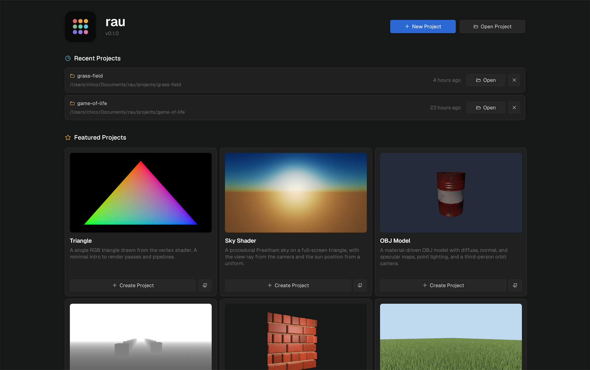

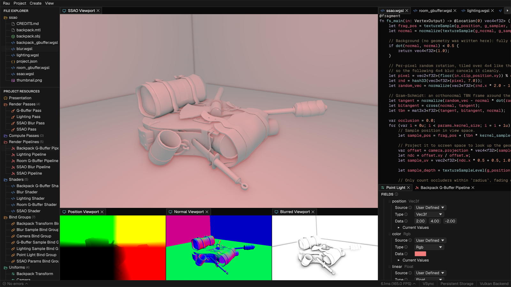

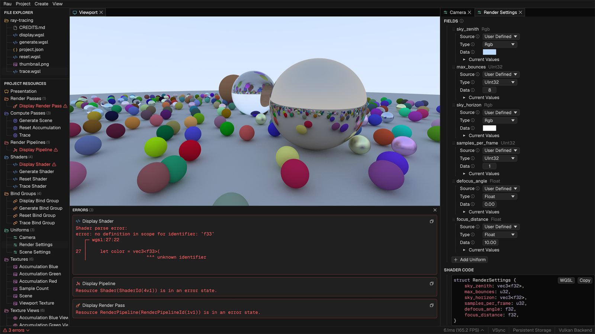

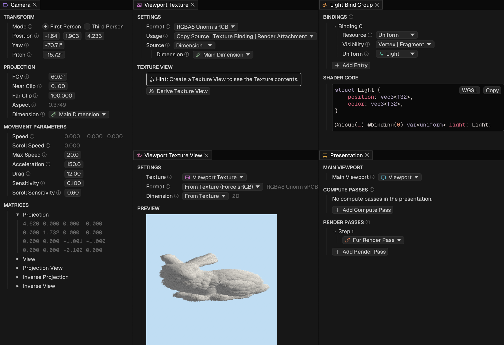

## License

Rau is released under the [MIT License](LICENSE.md).

Some [example projects](projects) include third-party code or assets under their own licenses, so check each project's folder for details.
