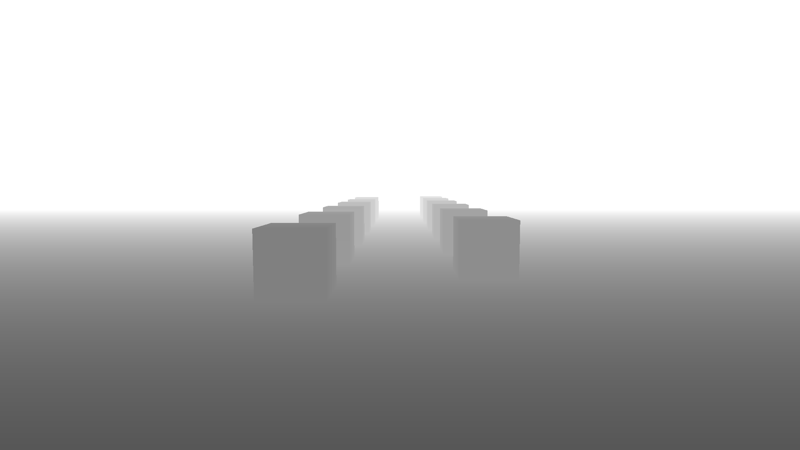

# Depth Testing

An avenue of instanced cubes over a floor, drawn in a scene pass that writes a depth buffer. A second pass reads that depth buffer and renders it in grayscale.

[Open in browser](https://rau.chicoferreira.dev/?action=new&owner=chicoferreira&repo=rau&ref=main&path=projects/depth-testing&name=Depth%20Testing)
