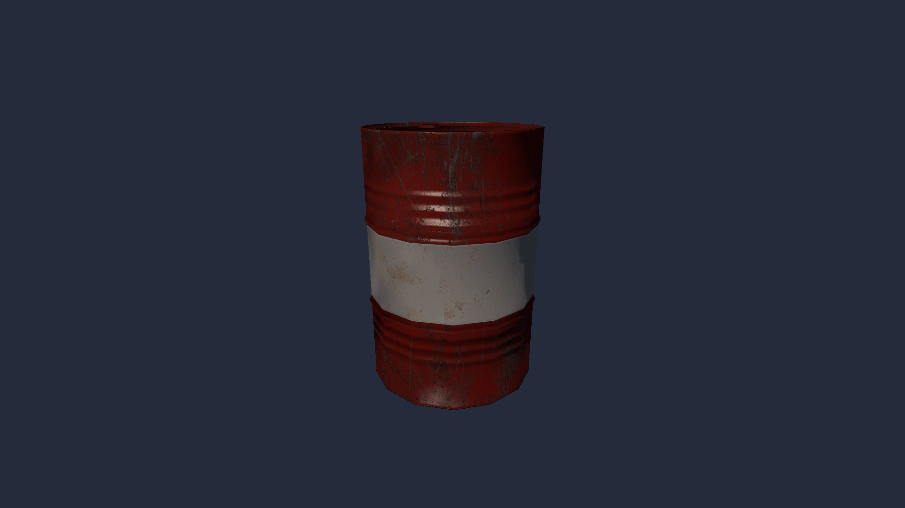

# OBJ Model

An OBJ model of a metal barrel with the diffuse, normal and specular maps from its materials, lit by a point light and viewed through a third-person orbit camera.

[Open in browser](https://rau.chicoferreira.dev/?action=new&owner=chicoferreira&repo=rau&ref=main&path=projects/model&name=OBJ%20Model)

## Credits

`metal_barrel/` (model and textures) is by [Nobiax](https://nobiax.deviantart.com), free to use and modify in any work, personal or commercial. See [`metal_barrel/readme.txt`](metal_barrel/readme.txt).
