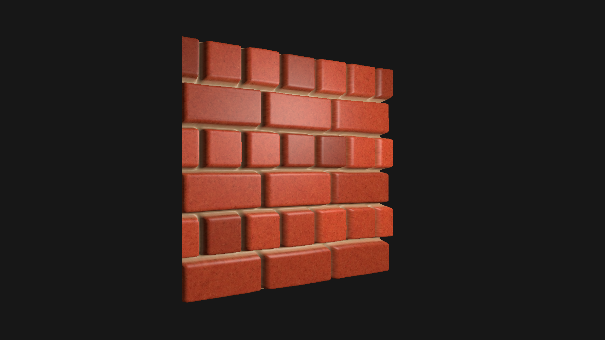

# Parallax Mapping

Ported from the [Parallax Mapping](https://learnopengl.com/Advanced-Lighting/Parallax-Mapping) chapter of LearnOpenGL. A brick wall with diffuse, normal and displacement maps. Parallax occlusion mapping marches the view ray through the displacement map in tangent space, faking real surface depth on a flat quad.

[Open in browser](https://rau.chicoferreira.dev/?action=new&owner=chicoferreira&repo=rau&ref=main&path=projects/parallax-mapping&name=Parallax%20Mapping)

## Credits

All shaders and textures come from the [Parallax Mapping](https://learnopengl.com/Advanced-Lighting/Parallax-Mapping) chapter of [LearnOpenGL](https://learnopengl.com) by Joey de Vries. Check [LearnOpenGL's licensing](https://learnopengl.com/About) for licensing details.
