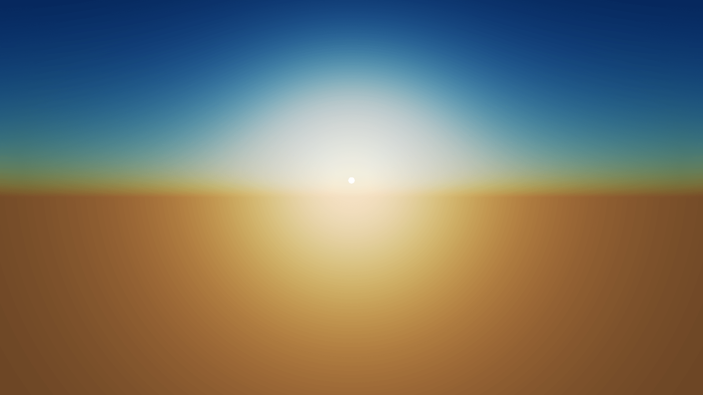

# Sky Shader

Ported from the [sky-shader example](https://github.com/EmbarkStudios/rust-gpu/blob/main/examples/shaders/sky-shader/src/lib.rs) of rust-gpu. A procedural sky using the Preetham analytic sky model, drawn on a full-screen triangle. The view ray comes from the camera and the sun position from a uniform, so the sky follows the camera and the sun can be moved from the inspector.

[Open in browser](https://rau.chicoferreira.dev/?action=new&owner=chicoferreira&repo=rau&ref=main&path=projects/sky-shader&name=Sky%20Shader)

## Credits

All shaders come from the [sky-shader example](https://github.com/EmbarkStudios/rust-gpu/blob/main/examples/shaders/sky-shader/src/lib.rs) of [rust-gpu](https://github.com/EmbarkStudios/rust-gpu) by Embark Studios. Check the [rust-gpu repository](https://github.com/EmbarkStudios/rust-gpu) for licensing details.
