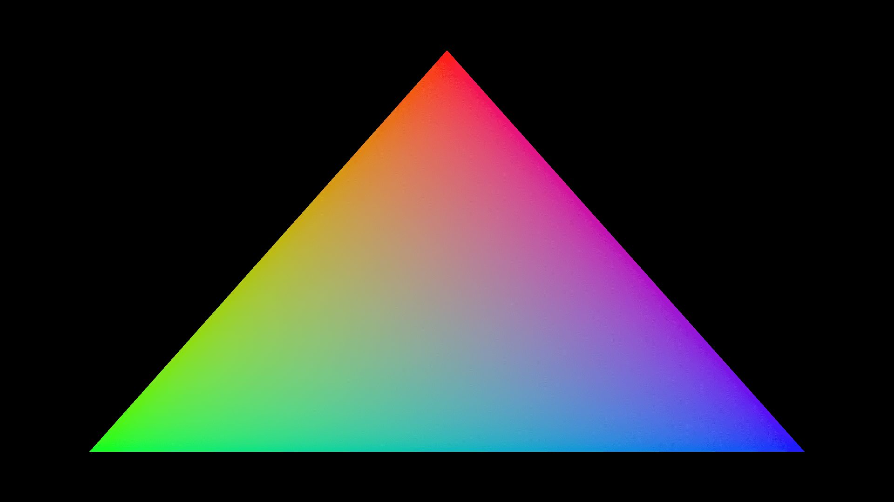

# Triangle

A single triangle with red, green and blue corners, generated entirely in the vertex shader with no vertex buffer. It is the smallest complete project: one shader, one render pipeline and one render pass.

[Open in browser](https://rau.chicoferreira.dev/?action=new&owner=chicoferreira&repo=rau&ref=main&path=projects/triangle&name=Triangle)
